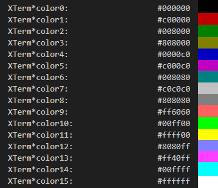

# Paramétrage de l'éditeur | Options et .vimrc  

Il est possible de paramétrer l'éditeur pendant qu'on l'utilise.  
Une autre méthode est de créer un fichier .vimrc dans son home pour définir les paramètres par défaut.  

## Options  

Dans l'éditeur, faire `:set ` suivi de l'option.  

`showmode` : Affiche le mode dans lequel on se trouve  
`nonumber` : Enlève les numéros de ligne  
`number`   : Affiche les numéros de lignes  
`ai` ou `autoindent` : Active l'auto-indentation  
`nohlsearch` : Désactive le surlignement des correspondances lors de recherches  
`ts=X` : Défini le nombre d'espace des tabulations (X étant le nombre d'espaces)  
`expandtab` : Assure que les tabulations soient des espaces  

**Sans `:set`**  
`abbr <abbr> <texte>` : Défini une abréviation pour un texte plus long. Exemple : `abbr _sh #!/bin/bash`. En tapant `_sh ` dans vim, un Shebang bash apparaît.  
`nmap <combinaison de touches> <opération>` : Exemple `nmap <C-N> :set invnumber<CR>` inverse les options `number`/`nonumber`  

### Options dans l'éditeur  

#### Désactivé l'autoindentation    
`:setl noai nocin nosi inde=`    

#### Copier des lignes dans un autre fichier  
`:6,8w newfile` : Copie les lignes 6 à 8 dans un nouveau fichier nommé `newfile`  

#### Importer le contenu d'un fichier  
`:r newfile` : Importe le contenu du fichier à l'endroit du curseur  

## Options sur le fichier  

`:w`  : Sauvegarder le fichier (write)  
`:q`  : Quitter  
`:wq` : Sauvegarder et quitter  
`:x`  : Sauvegarder et quitter  
`:q!` : Quitter sans enregistrer  
`:e!` : Effacer toutes les modifications jusqu'à la dernière version enregistré  

# Raccourcis    

## Déplacements  

`h`  : Gauche    
`j`  : Bas    
`k`  : Haut    
`l`  : Droite    
`g`  : Début du fichier    
`G`  : Fin du fichier    
`nG` : Ligne numéro "n"    
`^`  : Début de ligne  
`$`  : Fin de ligne
  
## Insertions  

`i` : Insérer sur le curseur  
`I` : Insérer au début de la ligne  
`a` : Insérer après le curseur  
`A` : Insérer à la fin de la ligne  
`o` : Insérer une nouvelle ligne en dessous  
`O` : Insérer une nouvelle ligne au-dessus  

## Copier/couper(supprimer)  

`x`   : supprime le caractère sous le curseur    
`X`   : supprime le caractère avant le curseur    
`yy`  : copie la ligne    
`nyy` : copie "n" lignes    
`dd`  : coupe la ligne    
`ndd` : coupe "n" lignes    
`p`   : coller    
`np`  : coller "n" fois    
`mk`  : place une balise    
`y'k` : pour copier de la ligne actuelle jusqu'à la ligne balisée    
`d'k` : pour couper de la ligne actuelle jusqu'à la ligne balisée    
  
## Divers  

`J`   : supprime le retour chariot de la ligne actuelle    
`~`   : Changement de casse  
`guu` : Change la casse de la ligne en minuscule    
`gUU` : Change la casse de la ligne en majuscule    
`guw` : Change la casse du mot en minuscule    
`gUw` : Change la casse du mot en majuscule    
`g~~` : Inverse la casse de la ligne    
`g~w` : Inverse la casse du mot   
`guG` : Change la casse jusqu'à la fin du document un minuscule    
`gUG` : Change la casse jusqu'à la fin du document un majuscule    

# Ouvrir un fichier avec vim à une ligne voulue  
`vim +x <fic>`: Ouvre le fichier \<fic\> et se place directement à la ligne x    
`vim +$ <fic>`: Ouvre le fichier \<fic\> directement à la dernière ligne    

# Sed et autre modifications dans vim  

<u>Syntaxe :</u>  

`:<lignes><action>/<motif>/<remplacement>/<portée>`    

Exemple *(suppression de lignes vides)* :    
`%s/^$//g`  

####  lignes  

`1,3` : Lignes de 1 à 3    
`%` : Toutes les lignes    
`21,$` : Lignes 21 jusqu'à la fin    
`.,$` : Ligne courrante jusqu'à la fin    
`.+1,$` : Ligne après la ligne courrante jusqu'à la fin    
`.,.+5` ou `.,.5` : La ligne courrante plus les 5 prochaines    

#### action  

`s` : substitution   
`y` :  

#### motif  

Il est possible d'utiliser ici les expressions régulières.    
On peut également "mémoriser" le résultat du motif, et le réutiliser ensuite, en utilisant les paranthèses dan    s le motif, et leur numéro dans le remplacement.  

#### remplacement  

Ici, on peut utiliser des métacaractères spécifiques:  

#### portée  

`g` : global *(recursive)*  

####  Autres commandes  

`g/^$/d` ou `v/./d` : Suppression des lignes vides    
`<lignes>d` : Suppression des lignes spécifiées    
`<lignes>m <pos>` : Déplacer les lignes à la position `<pos>`    
`<lignes>t <pos>` : Copier les lignes à la position `<pos>`    
`g/<motif>` : Renvoi une liste des correspondance    
`<ligne>w <fic>` : Ecrit toutes les lignes dans un fichier `<fic>`    

# Commandes diverses  

`:x,y sort` : Tri les lignes x à y  

# Colorscheme  

Chemin : /usr/share/vim/vim82/colors/ ou ~/.vim/colors/  

Couleurs :  

XTerm :  
  

```shell
	Suggested color names (these are available on most systems):
	    Red		LightRed	DarkRed
	    Green	LightGreen	DarkGreen	SeaGreen
	    Blue	LightBlue	DarkBlue	SlateBlue
	    Cyan	LightCyan	DarkCyan
	    Magenta	LightMagenta	DarkMagenta
	    Yellow	LightYellow	Brown		DarkYellow
	    Gray	LightGray	DarkGray
	    Black	White
	    Orange	Purple		Violet
```
